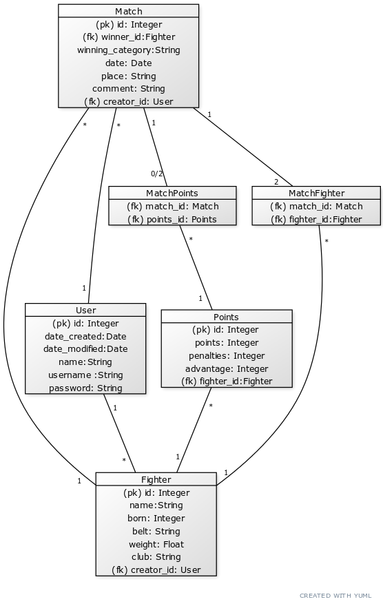

## Sovelluksen tietokannan rakenne

Tietokanta koostuu neljästä taulusta ja kahdesta liitostaulusta
### Tietokantakaavio




### Tietokannan SQL-luontilauseet

#### User nimellä account -rekisteröityneet käyttäjät
```
CREATE TABLE account (
	id INTEGER NOT NULL, 
	date_created DATETIME, 
	date_modified DATETIME, 
	name VARCHAR(144) NOT NULL, 
	username VARCHAR(144) NOT NULL, 
	password VARCHAR(144) NOT NULL, 
	PRIMARY KEY (id)
)
```

#### Match -tallennetut ottelut
```
CREATE TABLE match (
	id INTEGER NOT NULL, 
	date DATE, 
	place VARCHAR(144) NOT NULL, 
	winner_id INTEGER, 
	winning_category VARCHAR(144), 
	comment VARCHAR(100), 
	creator_id INTEGER NOT NULL, 
	PRIMARY KEY (id), 
	FOREIGN KEY(creator_id) REFERENCES account (id)
)
```

#### Fighter - tallennetut ottelijat
```
CREATE TABLE fighter (
	id INTEGER NOT NULL, 
	name VARCHAR(50) NOT NULL, 
	born INTEGER, 
	belt VARCHAR(50) NOT NULL, 
	club VARCHAR(144), 
	weight FLOAT, 
	creator_id INTEGER NOT NULL, 
	PRIMARY KEY (id), 
	FOREIGN KEY(creator_id) REFERENCES account (id)
)
```

#### Points - pistevoitto-otteluun liittyvät pisteet
```
CREATE TABLE points (
	id INTEGER NOT NULL, 
	points INTEGER NOT NULL, 
	penalties INTEGER NOT NULL, 
	advantage INTEGER NOT NULL, 
	fighter_id INTEGER NOT NULL, 
	PRIMARY KEY (id), 
	FOREIGN KEY(fighter_id) REFERENCES fighter (id)
)
```

#### MatchFighter -liitostaulu ottelun ja ottelijoiden yhdistämiseen
```
CREATE TABLE matchfighter (
	match_id INTEGER NOT NULL, 
	fighter_id INTEGER NOT NULL, 
	FOREIGN KEY(match_id) REFERENCES "match" (id), 
	FOREIGN KEY(fighter_id) REFERENCES fighter (id)
)
```

#### MatchPoints - liitostaulu pistevoitto-ottelun ja pisteiden yhdistämiseen
```
CREATE TABLE matchpoints (
	match_id INTEGER NOT NULL, 
	points_id INTEGER NOT NULL, 
	FOREIGN KEY(match_id) REFERENCES "match" (id), 
	FOREIGN KEY(points_id) REFERENCES points (id)
)
```
